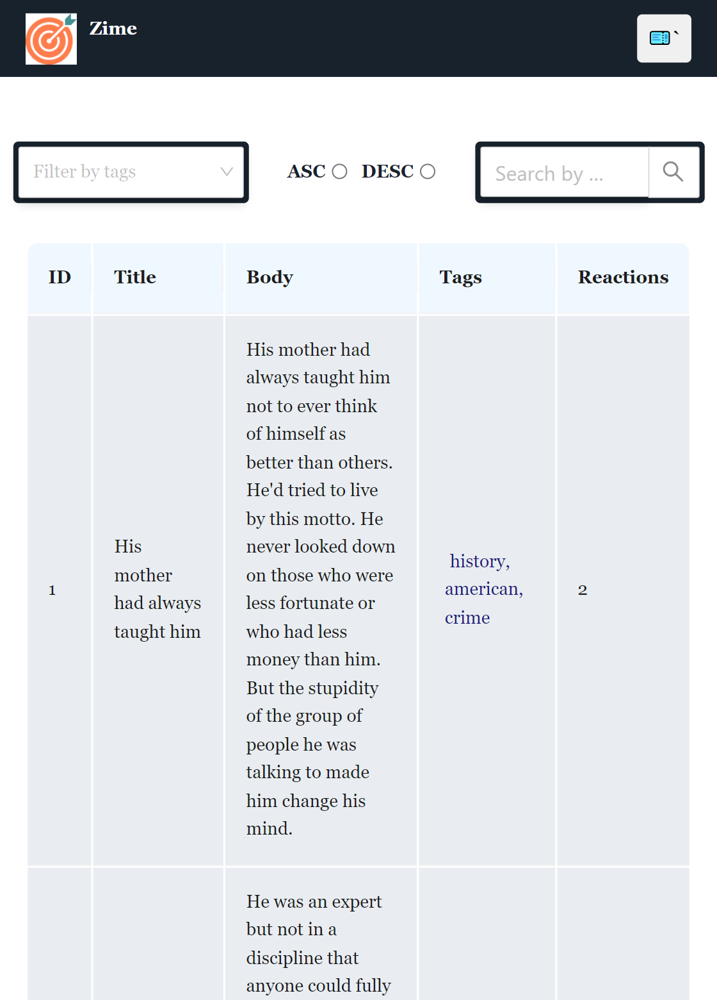

# zime-ai React-app
Basic task Application

# Preview :https://zime-ai.vercel.app/

# video : 

## Screenshots
## Top Section

# Footer section

# Top Section mobile view

#  Footer sectionmobile view

## Deployment

Deployed Link: https://zime-ai.vercel.app/

# Clone the repository

https://github.com/mohdadil12345/zime-ai

### features

- sorting filtering pagination seacrh functionality applied
- sortin filtering pagination and search funcionality work simultaneously with dynamic url applied
- Fully Responsive websites in mobile viewa dn tablet view
- For designing used css.
- Ant Design framework used

## Tools and Technologies
- Javascript
- React
- Html
- css
- AntDesign

## Installation and Setup

1.Install React npm : npm i
2. Run the Application : ng run start

